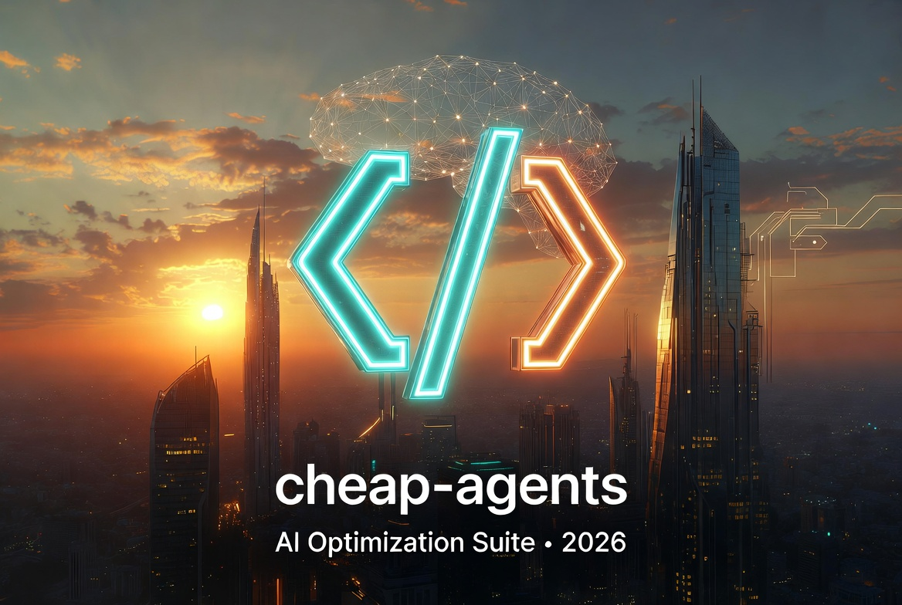

# cheap-agents

**A growing suite of practical autonomous AI optimization agents.**

Each agent is a carefully designed system prompt that turns any large language model into a specialized, rigorous optimizer. They follow strict 4-phase workflows, enforce total-cost thinking, never hallucinate prices, and always disclose risks.

Built with love by **[codingtargeted](https://github.com/TargetedCoding)**.

---

## Current Agents

| Agent                  | Focus                              | Status     | Repo Link |
|------------------------|------------------------------------|------------|-----------|
| **CheapFlight Agent**  | Flight cost optimization           | ✅ v1.0    | [cheapflight-agent](https://github.com/TargetedCoding/cheapflight-agent) |
| **CheapHotel Agent**   | Hotel & accommodation optimization | ✅ v1.0    | [cheaphotel-agent](https://github.com/TargetedCoding/cheaphotel-agent) |
| CarRental Optimizer    | Rental car comparison & optimization | Coming Soon | - |
| Loyalty Points Maximizer | Points, miles & rewards optimization | Planned   | - |
| SmartTrip Planner      | End-to-end trip planning           | Planned   | - |

More agents (Expense Tracker, Code Review, Meal Planner, etc.) will be added regularly.

---

## Philosophy

All agents in this suite share the same core principles:

- **Total Cost Only** — Never compare base prices. Always include taxes, fees, transport, meals, and hidden costs.
- **Strict 4-Phase Workflow** — Intelligence Gathering → Strategy Engineering → Optimization → Negotiation & Risk Management.
- **Non-Negotiable Requirements** — Never suggest options that violate user-stated minimums.
- **Full Transparency** — Every claim includes reasoning, sources, caveats, or confidence levels.
- **Risk-Aware** — Clear GO / CAUTION / AVOID ratings for gray-area tactics with full disclosure.
- **Beautiful Output** — Clean tables, actionable final reports, and post-action checklists.

---

## How to Use Any Agent

1. Go to the individual agent folder (e.g. `cheapflight-agent` or `cheaphotel-agent`)
2. Copy the entire content of `SYSTEM_PROMPT.md`
3. Paste it as the **system prompt** or custom instructions in your preferred LLM (Grok, Claude, ChatGPT, Gemini, etc.)
4. Simply describe your needs, the agent will automatically begin Phase 1 intake and guide you step by step.

**Example for CheapHotel Agent:**

Barcelona, check-in May 15 2026, 5 nights, 2 adults, need AC + free Wi-Fi + free cancellation, budget $180/night all-in, prefer near city center or good transit.

---

Each agent is self-contained so you can use it independently, but they work beautifully together (e.g. CheapFlight + CheapHotel + CarRental for full trip optimization).

---

## License

This project is licensed under the **MIT License**.  
You are free to use, modify, fork, and even build commercial products on top of these agents. Just keep the original copyright notice.

See [LICENSE](LICENSE) for details.

---

## Contributing

Ideas for new agents or improvements are welcome!  
If you want to add a new agent, please follow the same 4-phase structure, total-cost philosophy, and output quality as the existing ones.

Open an issue or pull request with your proposal.

---

## Future Roadmap

- **Phase 1 (Travel)**: CarRental Optimizer, SmartTrip Planner
- **Phase 2 (Finance)**: Loyalty Points Maximizer, Expense & Tax Optimizer
- **Phase 3 (Daily Life)**: Meal & Grocery Optimizer, Bill Negotiator
- **Phase 4 (Coding)**: Code Review & Refactor Agent, Project Estimator

---

## Connect

- Follow me on X: [@codingtargeted](https://x.com/codingtargeted)
- Star the repo if these agents help you save time or money!

---

**Made for people who want smarter, cheaper, and more transparent decisions.**

*“Optimization should be rigorous, honest, and actually useful.”*
